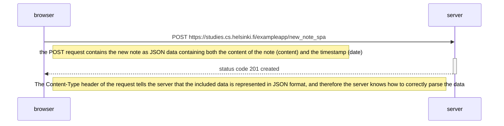

```mermaid

sequenceDiagram
  participant browser
  participant server

  browser->>server: POST https://studies.cs.helsinki.fi/exampleapp/new_note_spa
  
    Note right of browser: the POST request contains the new note as JSON data containing both the content of the note (content) and the timestamp (date)
  
  activate server
  server-->>browser: status code 201 created
  deactivate server
  
    Note left of server: The Content-Type header of the request tells the server that the included data is represented in JSON format, and therefore the server knows how to correctly parse the data

```
