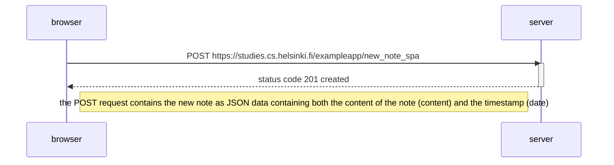

```mermaid

sequenceDiagram
  participant browser
  participant server

  browser->>server: POST https://studies.cs.helsinki.fi/exampleapp/new_note_spa
  activate server
  server-->>browser: status code 201 created
  deactivate server
  
  Note right of browser: the POST request contains the new note as JSON data containing both the content of the note (content) and the timestamp (date)

```
